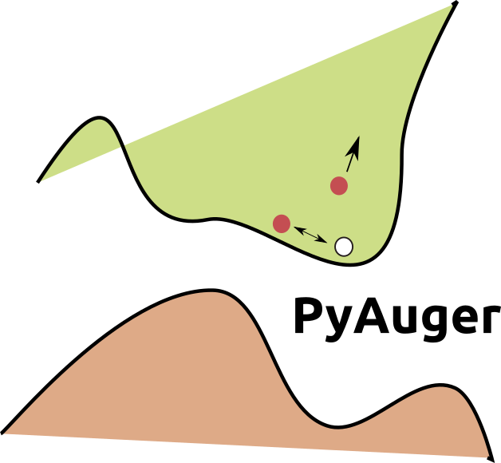

# PyAuger v-0.0.1
An incomplete First-Principle Auger Computation Code in Python with [VASP](https://www.vasp.at/).

<p align="center">
  
</p>


### The MIT License (MIT)

Permission is hereby granted, free of charge, to any person obtaining a copy of this software and associated documentation files (the "Software"), to deal in the Software without restriction, including without limitation the rights to use, copy, modify, merge, publish, distribute, sublicense, and/or sell copies of the Software, and to permit persons to whom the Software is furnished to do so, subject to the following conditions:

The above copyright notice and this permission notice shall be included in all copies or substantial portions of the Software.

THE SOFTWARE IS PROVIDED "AS IS", WITHOUT WARRANTY OF ANY KIND, EXPRESS OR IMPLIED, INCLUDING BUT NOT LIMITED TO THE WARRANTIES OF MERCHANTABILITY, FITNESS FOR A PARTICULAR PURPOSE AND NONINFRINGEMENT. IN NO EVENT SHALL THE AUTHORS OR COPYRIGHT HOLDERS BE LIABLE FOR ANY CLAIM, DAMAGES OR OTHER LIABILITY, WHETHER IN AN ACTION OF CONTRACT, TORT OR OTHERWISE, ARISING FROM, OUT OF OR IN CONNECTION WITH THE SOFTWARE OR THE USE OR OTHER DEALINGS IN THE SOFTWARE.

## Requirements
You can use *conda* to create an environment with the following *yaml*.
```
name: pyauger
dependencies:
  - numpy
  - scipy
  - matplotlib
  - pandas
  - pillow
  - graphviz
  - python-graphviz
  - imageio
  - joblib
```
The code was created and tested with the following versions -
* python 3.9.13
* numpy 1.21.5
* scipy 1.7.3
* matplotlib 3.5.2
* seaborn 0.12.1
* pymatgen >= 2022.x
* pandas 1.4.2
---
* * *
## Background

In the pursuit of quantifying the temporal evolution of carrier states, we resort to the application of the Fermi Golden Rule derived from the principles of time-dependent perturbation theory. This approach empowers us to accurately evaluate the probability of transition between states, facilitating a comprehensive understanding of the dynamic behavior of carriers over time.
$$C_{auger}=\text{constant}\times\sum_{\mathbf{1234}}\mathbf{P_{1234}}|\mathbf{M_{1234}}|^2\delta(E_1+E_2-E_3-E_4)$$
where, $P_{1234}=f_1f_2(1-f_3)(1-f_4)$, $f_n$ is the Fermi-Dirac distribution $$f(E) = \left[ e^{(E-E_F)/k_BT}+1 \right] ^{-1}$$ The $\delta(E_1+E_2-E_3-E_4)$ function is modeled in terms of a Gaussian function.
 $$\delta(E_1+E_2-E_3-E_4) \approx e^{-(E_1+E_2-E_3-E_4)^2/2\sigma^2}$$
 Please note that the current incomplete version of the code $C'_{auger}=\sum_{\mathbf{1234}}\mathbf{P_{1234}}\delta(E_1+E_2-E_3-E_4)$. That is - $|\mathbf{M_{1234}}|^2$ has not been implemented yet.
 
 ---
* * *
## Running a Computation: A Step-by-Step Guide

1. **PBE Bandstructure Calculation** <br /> Perform a regular PBE bandstructure calculation using the *pymatgen* package. You can find an example of this process in the provided [Link](http://matgenb.materialsvirtuallab.org/2017/04/14/Inputs-and-Analysis-of-VASP-runs.html).  Please note that some functionalities might differ in the updated *Material Project* new API [examples](https://docs.materialsproject.org/downloading-data/using-the-api/examples).
2. **Set Up Directory** <br /> Copy the non-SCF (self-consistent field) directory and place the *k_grid_sample.sh* script within it.
3. **Adjust INCAR File and Run Non-SCF Calculations**  Review the INCAR file tags and make any necessary adjustments. Once satisfied, execute the *k_grid_sample.sh* script. This script will initiate non-SCF calculations for various k-grids, which can be configured from within the script itself. Please carefully examine the script's content.
4. **Post-Computation Analysis** <br /> After the calculations are converged, copy the *parse_output.py* Python script from the directory. This script can be used to check convergence, parse Fermi energy, k-grid details, band energies, point weights, and more. You can customize the script according to your needs. Ensure that the directory contains *KPOINTS, vasprun.xml,* and *EIGENVAL* files as these are required by the script. <br /> Subsequently, execute the *get_fermi_cutoff.py* script. This action will produce a text file named *band_info.txt*, which will encompass details such as the fermi energy, as well as the minimum and maximum band indices necessary for running the *parallel*_carlo.py* or *carlo_auger.py* code in the later stages.<br /> Generally, this step needs to be carried out only once, for instance with a $20\times20\times20$ or $50\times50\times50$ kgrid configuration, since empirical tests have shown minimal variance in the band indices as the kgrid dimensions are increased.
5. **File Naming** <br /> File names are self-explanatory. For instance, *kw_10_47.npy* is the k-point weight file resulting from a $10\times10\times10$ k-grid computation with 47 irreducible k-points. I will call $10$ as $X$ and $47$ as $XX$. So, for $20\times20\times20$ grid, $X=20$ and $XX=256$ as there are $256$ irreducible k-points.  How do you get these numbers? *parse_output.py* script will tell you these numbers when you run it.
6. **Create a New Directory** <br /> Run the *create_oj_dir.sh* script. It will create a new directory called *auger_main* and copy all *.npy* files in that directory.  Along with these, you need to copy *parallel_carlo.py* or *carlo_auger.py* and job submission script to the *auger_main* directory.  The difference between *parallel_carlo.py* and *carlo_auger.py* is that one is parallel and one is serial. The difference and best practices have been explained in a later section.
7. **Run Calculation** <br /> Execute the *job_script.sh* script. Before each run, remember to modify the job name. Also, update the $X$ and $XX$ tags in the *parallel_carlo.py* script as necessary.
8. **Check Outputs** <br /> Upon completion of a computation, read the *job-name.out* file for results. For details of any errors, refer to the *job-name.err* file.  These steps guide you through the process of using the provided code for Auger computations. If you encounter any issues or need further assistance, please refer to this documentation or contact the relevant support channels.

---
* * *

## Things to keep in mind

1. **Model Hyperparameter** <br />
The hyperparameter $\sigma$ plays a critical role within the model's configuration. Currently, it has been predefined as 0.01, reflecting the existing setting. However, it's worth noting that the code allows for flexible adjustment of this hyperparameter. One can also try adding the prefactor in the delta function ($1/\sqrt{2\pi}\sigma$). Should the need arise to fine-tune or optimize the $\sigma$ value to align with specific requirements, such modifications can be made directly within the codebase.
<br />Simple change $\sigma = 0.01$ to a desired value in the definition of *delta_func* function in the *utility.py* script. Similarly, to add the prefactor, replace the definition with the following:
```
    def delta_func(E1, E2, E3, E4, sigma=0.01):
       # Computes the Gaussian model of the delta function.
       prefactor = 1/(np.sqrt(2 * np.pi) * sigma)
       return prefactor * np.exp(-(E1 + E2 - E3 - E4)**2 / (2 * sigma**2))
```
This level of adaptability ensures that the model's performance can be effectively tailored to meet varying scenarios and objectives. <br />

2. **Changing Temperature** <br />
The computations will be executed at a temperature of $T=300K$. If you wish to modify the temperature, adjust the associated variable $T$ within the *fermi_dirac()* function.
```
def fermi_dirac(E, E_Fermi, k_B=8.617333262145e-5, T=300):
    return expit((E_Fermi - E) / (k_B * T))
```

4. **Optimal Computation Focus** <br />
For optimal efficiency and accuracy, it is recommended to restrict computations to bands situated close to the band edges. The provided code specifically targets transitions within the range of 30 bands around the Fermi energy. This approach ensures that the computational efforts are concentrated on relevant electronic transitions, enhancing the precision of the results while conserving computational resources. Although, this number can easily be changed.
```
i_min = 6 # copy it from band_info.txt or change this
i_max = 26 # copy it from band_info.txt or change this
```

 ---
* * *
## Code Variants: Serial and Parallel

The code is available in both serial and parallel versions, each with distinct performance characteristics. The parallel version is designed to enhance execution speed by utilizing multiple processing units (using *joblib* library).
1. **Performance Comparison**  
While the parallel version offers faster execution times, it is important to note that the computational gains might not be substantial in all scenarios. Initial test runs indicate that the performance improvement might not be significant.

2. **Optimization Factors**  
To achieve the best performance for your specific use case, consider the following optimization factors:
 1. **Total Monte Carlo Samples:** Experiment with varying the number of total Monte Carlo samples. Adjusting this parameter could impact the execution speed and accuracy of results. `nbr_samples_in_total = change this `
 2. **Number of Parallel Blocks:** Modify the number of parallel blocks used during execution. Finding the optimal balance between parallelization and computational efficiency is key. `nbr_parallel_blocks = change this`
 3. **Performance Evaluation:** Conduct thorough performance evaluations by testing different configurations and measuring their impact on both serial and parallel versions.

3. **Experiment and Refine**  
To determine the most effective configuration for your computational needs, it is recommended to experiment with different combinations of parameters. This process involves adjusting the total Monte Carlo samples, number of parallel blocks, and other relevant parameters to find the optimal balance between execution time and results accuracy.


<br /> Keep in mind that the choice between the serial and parallel versions should be driven by the specific requirements of your task and the available hardware resources.
